# 🌊 Monsoon Coastal Monitoring via SAR-to-Optical cGAN

<div align="center">

**Reconstructing Monsoon-Season Coastal Land Cover and Shoreline Position from Sentinel-1 SAR Using a Conditional Generative Adversarial Network**

_A Case Study of the Brahmapur–Ganjam Coastline, Odisha, India_

[](https://www.python.org/)
[](https://pytorch.org/)
[](https://earthengine.google.com/)
[](LICENSE)
[]()

</div>

---

> **The Problem:** The southwest monsoon (June–September) is the period of _peak coastal hazard_ on India's Bay of Bengal coast — yet optical satellite monitoring is effectively impossible during these months owing to near-complete cloud cover. No monsoon-season shoreline or land cover map has ever existed for the Ganjam coastline.
>
> **This study fills that gap.**

---

## 📌 Overview

This repository contains the full pipeline for a **conditional GAN (cGAN)** framework trained to synthesise cloud-free Sentinel-2 multispectral imagery from contemporaneous **Sentinel-1 SAR inputs**, enabling the first ever monsoon-onset shoreline and land cover record for the **Brahmapur–Ganjam coastline, Odisha, India**.

The model uses an **Attention U-Net** generator paired with a **70×70 PatchGAN** discriminator. Applied to three monsoon-onset dates (2021-06-03, 2022-06-10, 2023-06-05), reconstructed imagery was used to extract shorelines and classify coastal land cover — independently validated against real Sentinel-2 ground truth.

This is a **companion study** to:

> Pradhan M. (2025a). _Multi-temporal shoreline change analysis and land cover dynamics of the Ganjam coastline, Odisha, India (2013–2024): a remote sensing and DSAS approach._ [submitted]

---

## 🏆 Key Results

| Metric    | U-Net (Ablation) | **cGAN (Primary)** |
| --------- | ---------------- | ------------------ |
| PSNR (dB) | 29.17            | **33.30**          |
| SSIM      | 0.818            | **0.873**          |
| NDWI R²   | 0.075            | **0.776**          |
| MNDWI R²  | 0.032            | **0.797**          |
| NDVI R²   | −0.328           | **0.734**          |

> The U-Net baseline NDWI R² ≈ 0.075 would produce physically meaningless shoreline extractions. **Adversarial training is not a perceptual refinement — it is structurally necessary.**

**Monsoon Shoreline Signal (119 DSAS transects):**

| Year                  | n valid | Mean displacement (m) | Std (m) |
| --------------------- | ------- | --------------------- | ------- |
| 2021                  | 78      | −47.2                 | 220.4   |
| 2022                  | 80      | −95.5                 | 187.2   |
| 2023                  | 72      | −43.4                 | 213.0   |
| Post-monsoon baseline | 309     | 37.2% landward        | —       |

**80.0% of monsoon-onset shorelines were landward of post-monsoon counterparts** (post-monsoon baseline: 37.2%). Validated against ground truth: **80.0% (GAN) vs. 79.0% (GT)** — a one-percentage-point difference across 100 matched transect-year observations.

**Monsoon Land Cover (MNDWI-threshold, km²):**

| Year     | Land       | Intertidal | Water     | Total      |
| -------- | ---------- | ---------- | --------- | ---------- |
| 2021     | 49.516     | 7.135      | 8.582     | 65.233     |
| 2022     | 48.405     | 7.141      | 9.688     | 65.234     |
| **2023** | **46.044** | **13.342** | **5.848** | **65.234** |

---

## 🏗️ Architecture

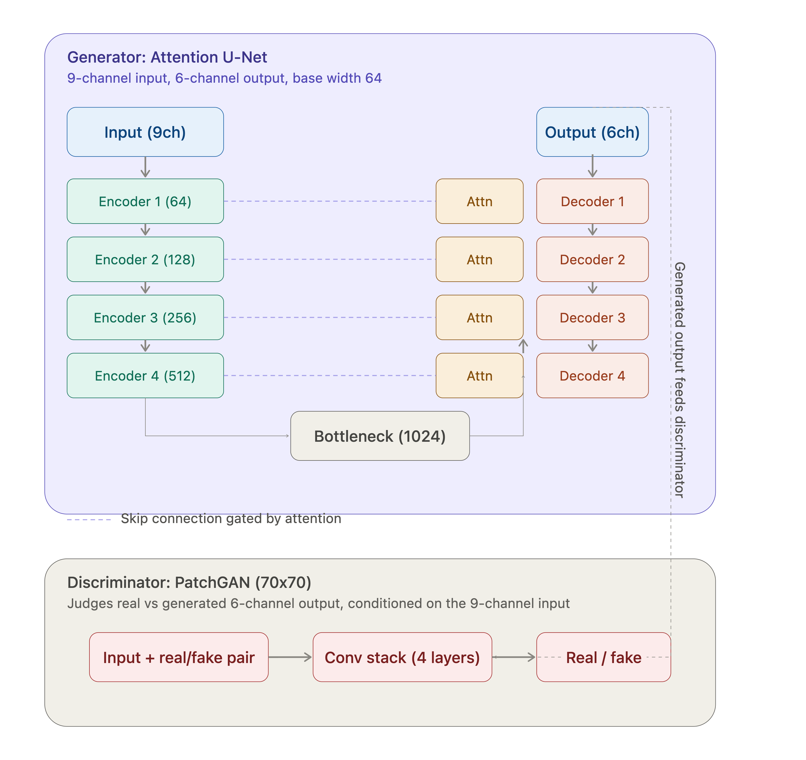
_Conditional GAN architecture. **Generator**: Attention U-Net (encoder widths 64/128/256/512, 1024-ch bottleneck, attention-gated skip connections). **Discriminator**: 70×70 PatchGAN classifying overlapping patches as real or generated._

### Why This Architecture?

- **Why U-Net over a plain encoder–decoder?** Skip connections carry high-resolution spatial structure directly to the decoder, preserving sharp water–land boundaries that shoreline extraction requires. A bottleneck-only design loses this spatial detail.
- **Why Attention Gates over standard skips?** Standard U-Net passes all encoder features indiscriminately, including irrelevant inland vegetation. Attention gates (Oktay et al. 2018) suppress these, concentrating decoder capacity on the beach face and intertidal zone — precisely the pixels that determine shoreline position.
- **Why PatchGAN over a full-image discriminator?** A full-image discriminator assesses realism at scene level, too coarse for local spectral contrast. The 70×70 PatchGAN penalises any locally unrealistic patch, which is directly responsible for recovering water-index fidelity (NDWI R² 0.776 vs. 0.075).
- **Why not Transformers or Diffusion models?** Both require far more data than the 311 within-domain paired patches available here. Transformer self-attention scales quadratically at 256×256; diffusion models need large denoising-step datasets. The convolutional cGAN achieves PSNR 33.30 dB / SSIM 0.873 without overfitting — and Run 3 confirmed additional capacity _actively degrades_ water-index metrics, confirming the bottleneck is domain data, not model expressivity.

---

## 🔄 End-to-End Pipeline

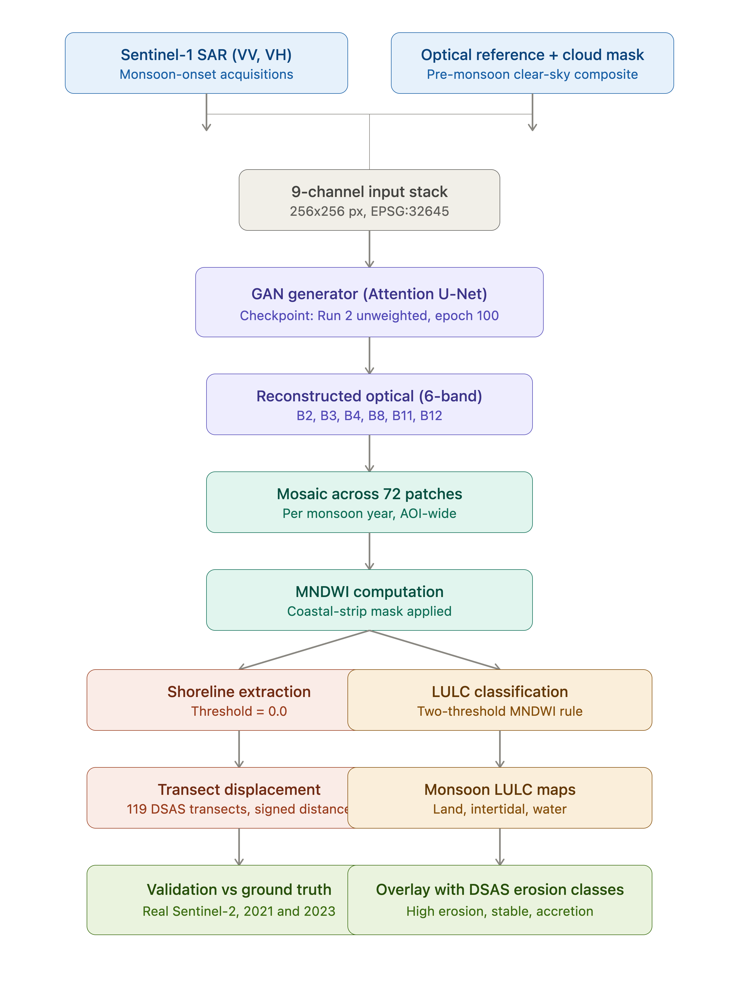
_Full inference pipeline: Sentinel-1 SAR + pre-monsoon optical reference → 9-channel GAN input → reconstructed 6-band optical mosaic (72 patches/year) → parallel shoreline extraction (MNDWI threshold 0.0) and LULC classification (two-threshold MNDWI rule)._

---

## 📁 Repository Structure

```
.
├── assets/                              # All figures (see below)
├── gee_scripts/                         # Google Earth Engine patch extraction
├── training/                            # Model training code
├── .gitignore
├── LICENSE
├── README.md
└── requirements.txt
```

---

## ⚙️ Setup & Installation

```bash
git clone https://github.com/yourusername/SAR-Optical-Synthesis.git
cd SAR-Optical-Synthesis
pip install -r requirements.txt
```

**Key dependencies:**

```
torch>=2.0
torchvision
rasterio
geopandas
shapely
numpy
scikit-learn
matplotlib
```

---

## 🚀 Usage

### 1. Patch Extraction (Google Earth Engine)

Run the script in `gee_scripts/` in the [GEE Code Editor](https://code.earthengine.google.com/). Set your GEE project to `sar-optical-synthesis`. Outputs 256×256 px patch pairs (10 m GSD, UTM 45N) to Google Drive.

### 2. Training

```bash
python training/train.py \
  --data_dir data/patches \
  --epochs 100 \
  --lambda_l1 100 \
  --seed 42 \
  --checkpoint_dir checkpoints/run2_unweighted
```

### 3. Monsoon Inference

```bash
python inference.py \
  --checkpoint checkpoints/run2_unweighted/gan_generator_epoch100.pt \
  --sar_dir data/monsoon_sar/2023 \
  --ref_optical data/reference_optical/pre_monsoon.tif \
  --output_dir results/mosaics/2023
```

### 4. Shoreline Extraction & DSAS

```bash
python shoreline/extract_shoreline.py --mosaic results/mosaics/2023 --threshold 0.0
python shoreline/dsas_transects.py --shoreline results/shorelines/2023.shp
```

### 5. LULC Classification

```bash
python lulc/classify_lulc.py --mosaic results/mosaics/2023 --output results/lulc/2023
```

---

## 📊 Results & Figures

### GAN-Reconstructed Mosaics

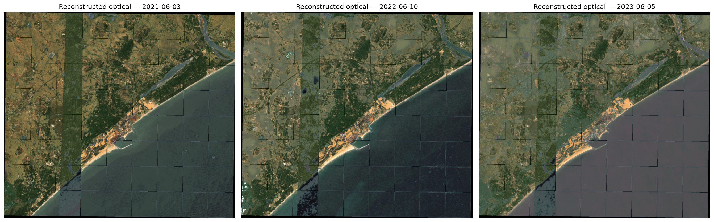
_GAN-reconstructed true-colour mosaics for 2021-06-03, 2022-06-10, 2023-06-05. 72 patches per mosaic at 10 m resolution. The 2023 mosaic shows markedly wider intertidal expression (pale sandy strip) along the beach face relative to 2021–2022._

---

### Per-Transect Seasonal Displacement

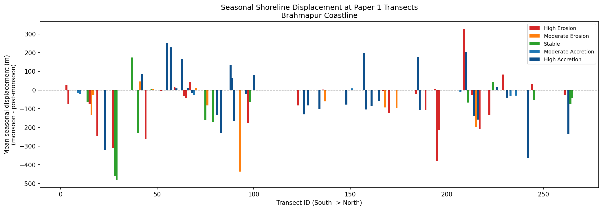
_Mean seasonal displacement (monsoon − post-monsoon) at 119 DSAS transects, ordered south to north. Colour denotes LRR erosion class from the companion study. Negative values indicate landward monsoon displacement._

---

### Validation Against Ground-Truth Optical Imagery

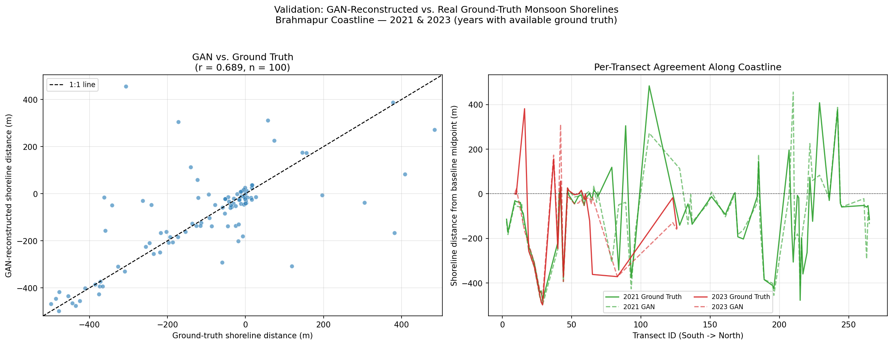
_Left: GAN vs. ground-truth shoreline distance from baseline midpoint scatter plot (r = 0.689, n = 100). Right: Per-transect along-coast agreement profile for 2021 (green) and 2023 (red); solid lines = ground truth, dashed = GAN._

---

### Monsoon LULC Maps (2021–2023)

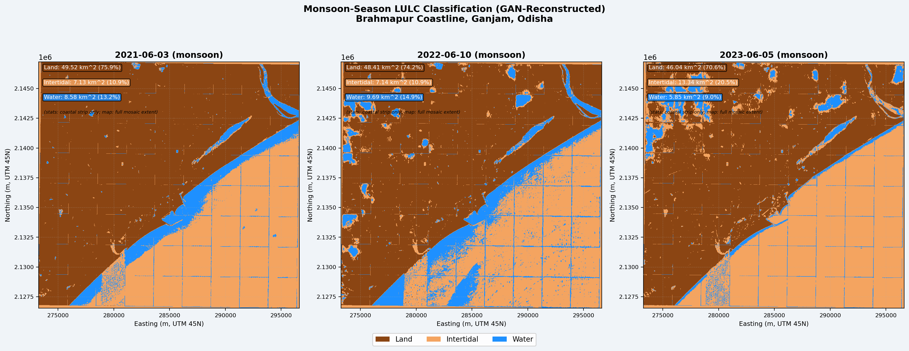
_Monsoon-season MNDWI-threshold land cover classification: 2021-06-03 (left), 2022-06-10 (centre), 2023-06-05 (right). Brown = Land, orange = Intertidal, blue = Water. Note the substantially wider intertidal band in 2023._

---

### Seasonal LULC Comparison (Monsoon vs. Post-Monsoon)

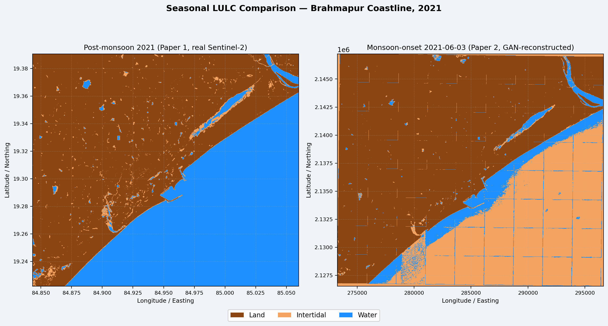
_Qualitative seasonal LULC comparison, 2021: post-monsoon (left, real Sentinel-2, companion study) vs. monsoon onset (right, GAN-reconstructed, this study). Both panels use the same MNDWI-threshold classification (Land / Intertidal / Water). Comparison is illustrative only; no pixel-aligned transition statistics are derived._

---

### DSAS Erosion Hotspot Overlay on Monsoon Land Cover

**2023 (enlarged)**

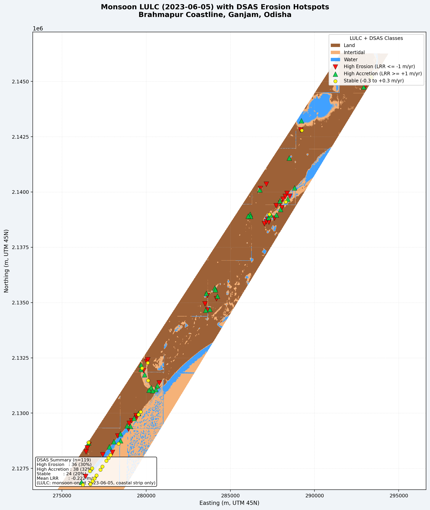

**2021 and 2022**

|                             2021-06-03                             |                             2022-06-10                             |
| :----------------------------------------------------------------: | :----------------------------------------------------------------: |
| 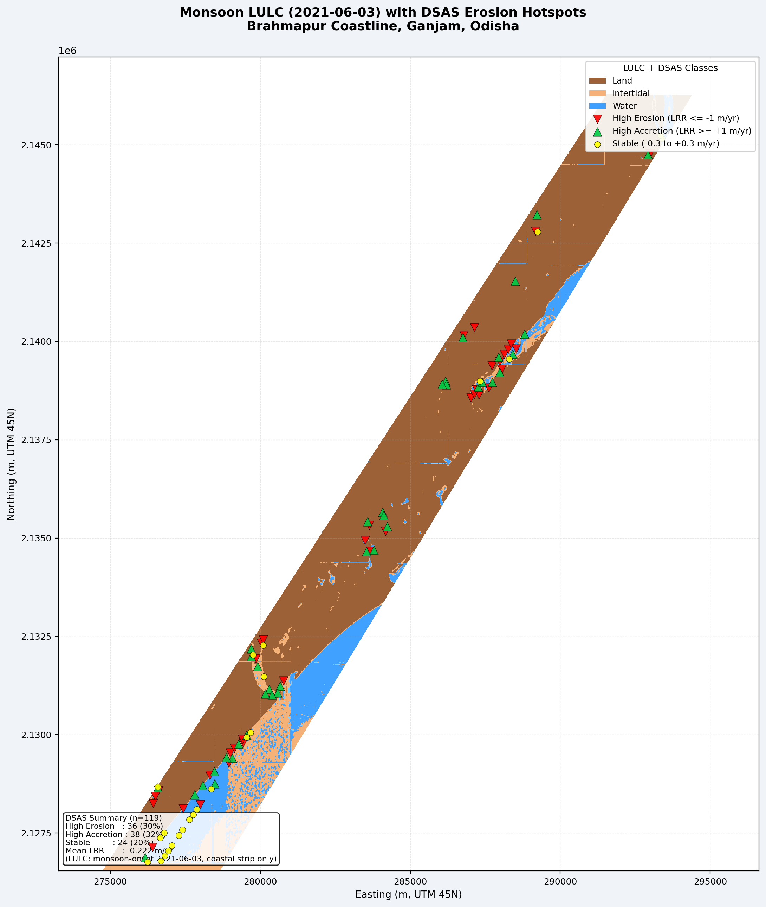 |  |

_DSAS erosion class overlay on monsoon LULC. Red ▼ = High Erosion (LRR ≤ −1.0 m/yr, n=36); green ▲ = High Accretion (≥ +1.0 m/yr, n=38); yellow ● = Stable (−0.3 to +0.3 m/yr, n=24). Mean LRR = −0.222 m/yr (companion study). High Erosion transects concentrate at the Rushikulya river mouth, where the intertidal band is widest and most fragmented._

---

### MNDWI Threshold Checks

|                          Baseline                          |                         Dual-Pol                         |                        Z-Score                         |
| :--------------------------------------------------------: | :------------------------------------------------------: | :----------------------------------------------------: |
| 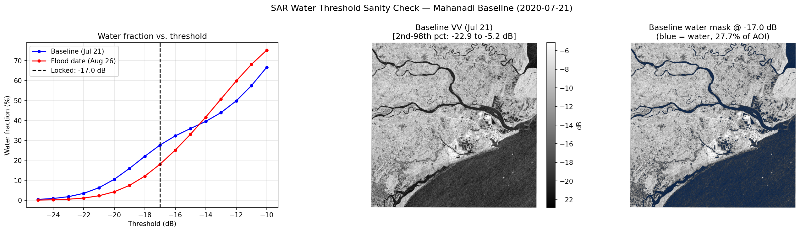 | 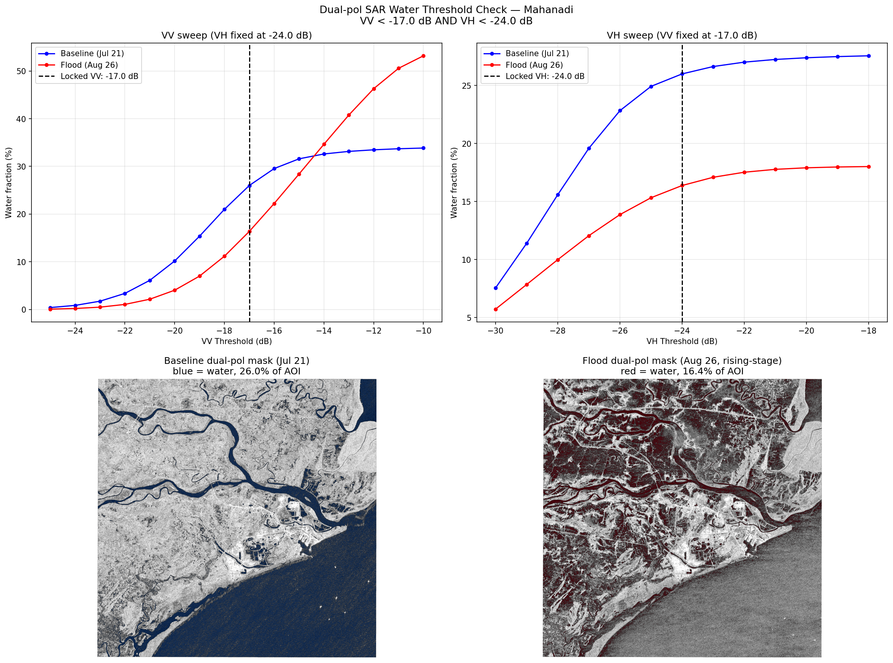 | 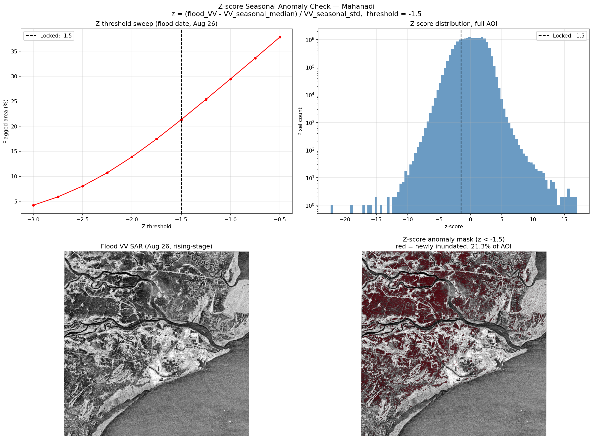 |

_MNDWI threshold sensitivity checks across methods, confirming threshold = 0.0 as the optimal land–water boundary for this domain._

---

## 📐 Validation Summary

| Metric                               | Value     |
| ------------------------------------ | --------- |
| Mean absolute error (MAE, m)         | 81.8      |
| Std of absolute error (m)            | 130.2     |
| Pearson r (GAN vs. Ground Truth)     | 0.689     |
| % transects landward — GAN           | **80.0%** |
| % transects landward — Ground Truth  | **79.0%** |
| N matched transect-year observations | 100       |

**Per-class MAE:** High Erosion 94.4 m · High Accretion 94.3 m · Moderate Erosion 75.7 m · Moderate Accretion 38.8 m · Stable 58.8 m — consistent with higher geomorphological complexity at river-mouth and depositional environments.

**Fragmentation note:** 73.5% of transect intersections were MultiPoint geometries. Standard post-processing corrections (nearest-prior selection, Gaussian smoothing σ=1px, morphological closing) all _increased_ MAE rather than reducing it — confirming fragmentation is irreducible reconstruction noise at the transect level. The coastline-wide aggregate signal is robust; site-specific claims at individual transects are not warranted.

---

## 🔬 Data & Methods

| Item              | Detail                                                                                |
| ----------------- | ------------------------------------------------------------------------------------- |
| SAR input         | Sentinel-1 IW GRD, DESCENDING orbit, 2021-06-03, 2022-06-10, 2023-06-05               |
| Optical reference | Sentinel-2 L2A pre-monsoon clear-sky composite (ESA Copernicus)                       |
| GAN input         | 9-channel: VV + VH (2ch) + S2 reference B2/B3/B4/B8/B11/B12 (6ch) + cloud mask (1ch)  |
| GAN output        | 6-channel: S2 B2/B3/B4/B8/B11/B12 at monsoon-onset date                               |
| Patch size        | 256×256 px at 10 m GSD (2,560 × 2,560 m extent)                                       |
| Training data     | 311 paired patches (Brahmapur + Mahanadi AOIs); 70/15/15 split, seed 42               |
| Test set          | 46 patches (3,014,656 pixels for R²; 44 patches for shoreline error)                  |
| Checkpoint        | `run2_unweighted/gan_generator_epoch100.pt`                                           |
| AOI               | 84.8433°E, 19.2221°N → 85.0599°E, 19.3906°N (EPSG:4326)                               |
| Projection        | UTM Zone 45N (EPSG:32645) for metric computation                                      |
| MNDWI threshold   | 0.0 (Xu 2006); diagonal coastal-strip mask excludes Tampara Lake                      |
| DSAS transects    | 119 transects at 250 m spacing, 2,000 m length, from 2013 baseline                    |
| Platform          | Google Earth Engine (`sar-optical-synthesis`) + Python (PyTorch, Rasterio, GeoPandas) |

---

## 📖 Citation

If you use this code or data, please cite:

```bibtex
@article{pradhan2025monsoon,
  title   = {Reconstructing Monsoon-Season Coastal Land Cover and Shoreline Position
             from Sentinel-1 SAR Using a Conditional Generative Adversarial Network:
             A Case Study of the Brahmapur Coastline, Odisha, India},
  author  = {Pradhan, Mohit},
  journal = {[Under Review]},
  year    = {2025},
  note    = {Companion study: Pradhan (2025a)}
}
```

---

## 🙏 Acknowledgements

- Supervisor: **Prof. Ratnakar Dash**, NIT Rourkela
- **Google Earth Engine** cloud computing (project: `sar-optical-synthesis`)
- **Sentinel-1 / Sentinel-2** imagery: European Space Agency (ESA) Copernicus Programme
- **ERA5** reanalysis: Open-Meteo (https://open-meteo.com)

---

## 📜 License

This project is licensed under the MIT License — see [LICENSE](LICENSE) for details.

---

<div align="center">
<b>Department of Computer Science, NIST University, Brahmapur, Odisha, India</b><br>
mohit.pradhan.cse.2023@nist.edu
</div>
